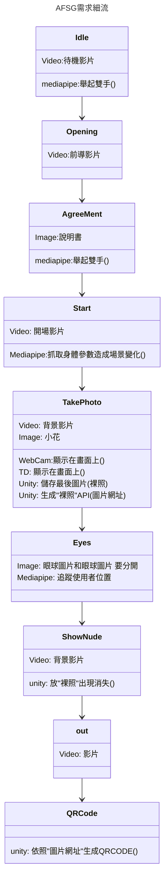

## 初始化
#### webcam 
因為webcam 會被多個程式占用 所以需要下載OBS

#### mediapipe
必須使用
python版本 3.9
並創造虛擬環境

下載連結
https://www.python.org/downloads/windows/

照著這個教學走
https://steam.oxxostudio.tw/category/python/ai/ai-mediapipe-2023.html

額外下載
``` sh
pip install pygrabber
```
#### touchDesigner
自己跟著裡面的教學下載"StreamDiffusion"的東西

## 技術使用

#### mediaPipe
啟動:
* 按下 /AFSG_MediaPipe/PressMe.bat 

#### TouchDesigner 
##### 輸入源
因為touchDesigner 抓不到 obs的虛擬鏡頭 所以需要
1. 將OBS 視窗化顯示
2. 調整touchDesigner 裡的輸入源變成OBS 額外跳出來的視窗

##### 啟動
按中間那個方塊 的 staet pause 就可以
## 整體流程 需求技術和資源
